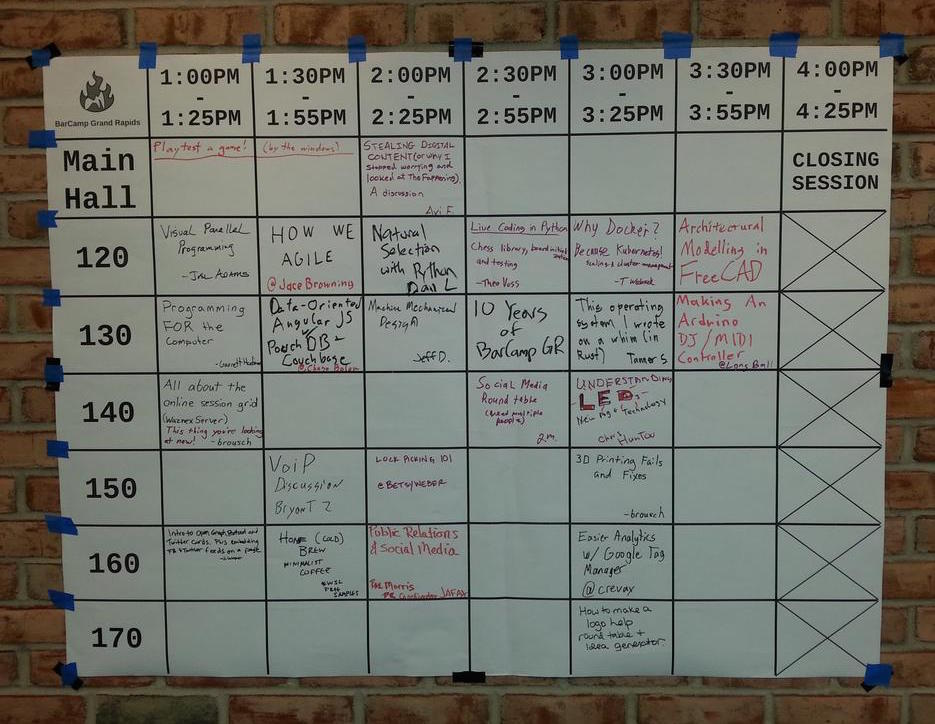

# WaznexServer #

*An Online BarCamp Session Grid Viewer*

Waznex Server (What's Next?) is a web application server designed for BarCamp Grand Rapids, but which should be useful for other BarCamps or conferences with a rapidly-changing physical session grid. Its purpose is to host an online version of the meatspace presentation session grid. Essentially, attendees upload a photo of the session grid to the WaznexServer instance:

and the server converts this into an interactive grid:

This allows attendees to see what's going on in upcoming sessions without going out to the lobby.

Waznex Server is based on the Flask microframework and can easily be hosted on a Linux or OSX server. I currently recommend running in production on an Ubuntu 18.04 with at least 1GB of RAM.

## Version 0.7 ##

- responsive full width display
- UI & wording updates
- show relative time since photo uploaded
- caching headers for static files
- auto-rotate iphone images
- system service for splitting the grid
- jinja loop fix
- pip/python2 bootstrap fix

## Version 0.6 ##

- Upgraded to Ubuntu 18.04 Bionic

## Version 0.5 ##

- Switched install from upstart to systemd for Ubuntu 16.04
- Moved to sockets for nginx to waznexserver communication

## Version 0.4 ##

- Added Vagrant for easier development
- Much improved Makefile for easier development and production installation
- Usable documentation

## Version 0.3 ##

- Newer versions of Flask and dependencies.
- Diagnostic image link between sizes and mark bad.
- Mark bad button.

## Version 0.2 ##

- It now has a database backend using SQLAlchemy instead of the thread-unsafe global list. This has only been tested with Sqlite so far.
- You can now control how many images are shown on the main page - it's no longer hard-coded to 3.

## Version 0.1 ##

- Version 0.1 includes the bare essentials of a working server.
- It can accept file uploads and will display the three most recent uploads using the mobile web theme.
- It generates two additional sized versions of each photo: a downsized version with maximum size of 1024x1024 pixels, and a thumbnail version with a maximum size of 316x316 pixels. The downsized version is useful for viewing on mobile platforms that limit download size (WebOS).  The thumbnail version is sized to fit the mobile theme width.

# Installation

## Development

1. Install Vagrant and a provider (VirtualBox)
2. Install git
3. `git clone https://github.com/brousch/WaznexServer.git`
4. `cd WaznexServer`
5. `vagrant up`
6. `vagrant ssh`

## Production on Ubuntu 18.04 64bit

1. SSH to server as root
2. `apt update`
3. `apt install -y make git`
4. `mkdir /opt/waznexserver`
5. `cd /opt/waznexserver`
6. `git clone https://github.com/brousch/WaznexServer.git`
7. `cd WaznexServer`
8. `make install_system_requirements`
9. `curl https://bootstrap.pypa.io/pip/2.7/get-pip.py | python`
10. `make bootstrap_modern_python_tools`  # lol modern
11. `make create_venv`
12. `make init_data`
13. `make init_production`

# Configuration

- Modify the image, downsized, and thumbnail paths found near the top of `config.py` to reflect your file system.
- Modify the `templates/index.html` file to change the page title.
- Modify the `static/css/main.css` file to change the style.
- Also be sure to disable debugging in a live deployment.

# Running

## Development

1. `vagrant ssh`
2. `cd /opt/waznexserver/Waznexserver`
3. `make run`
4. Run `waznexserver/process_grid.py` after uploading

## Production

1. SSH to server as root
2. `cd /opt/waznexserver/WaznexServer`
3. `make run_production`
4. Set up HTTPS e.g. https://www.linode.com/docs/guides/enabling-https-using-certbot-with-nginx-on-ubuntu
5. Set up HTTP/2 (just append `http2` to `listen`) e.g. https://www.linode.com/docs/guides/how-to-configure-http-2-on-nginx/

# Roadmap

- [View all images in a historic visualization][1]
- [Remove hard-coded paths][2]
- [Tests!][3]

[1]:https://github.com/brousch/WaznexServer/issues/3
[2]:https://github.com/brousch/WaznexServer/issues/7
[3]:https://github.com/brousch/WaznexServer/issues/11
